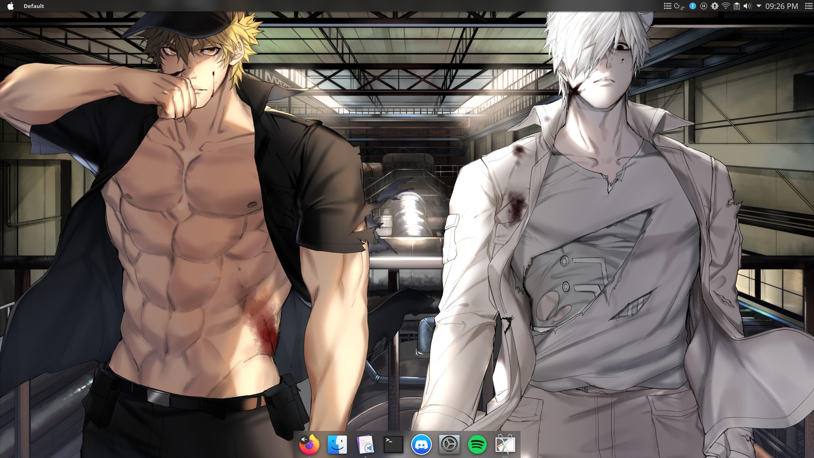

# Description

* Theme: Breeze Dark
* Plasma style: Breeze Dark
* Color: Breeze Dark
* Icons: Papirus Dark
* Application style engine: Kvantum dark
* Kvantum theme: akava
* Window decorations: Sierra Breeze
* Font: Noto sans (default)
* Cursors: Breeze
* Taskbar: Latte Dock
* Kwin scripts: Tiling extension, latte windows colors
* Login screen: Sugar Candy
* Widgets: application dashboard, global menu, window title, window buttons, weather
* Shell: Fish with shellder theme
* Konsole: White on black theme

Here is a dual screen view:


And a full screen view:


# Installation

1. Install chezmoi
```bash
sudo pacman -S chezmoi
```

2. Initialize chezmoi
```bash
chezmoi init https://github.com/Nomost80/dotfiles.git
```

3. See the diff
```bash
chezmoi diff
```

4. Apply the changes
```bash
chezmoi -v apply
# for appling the last changes without fetch
chezmoi update
```

# Links

* https://github.com/twpayne/chezmoi
* https://github.com/PapirusDevelopmentTeam/papirus-icon-theme
* https://github.com/tsujan/Kvantum/tree/master/Kvantum
* https://github.com/Akava-Design/Akava-Kv
* https://github.com/ishovkun/SierraBreeze
* https://github.com/KDE/latte-dock
* https://github.com/kwin-scripts/kwin-tiling
* https://github.com/psifidotos/applet-window-title
* https://github.com/psifidotos/applet-window-buttons
* https://store.kde.org/p/998917/
* https://github.com/fish-shell/fish-shell
